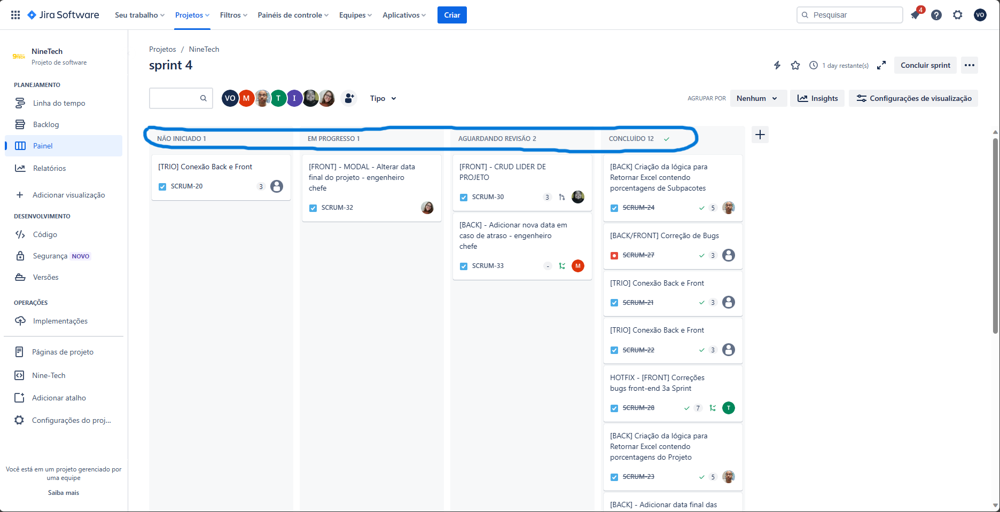
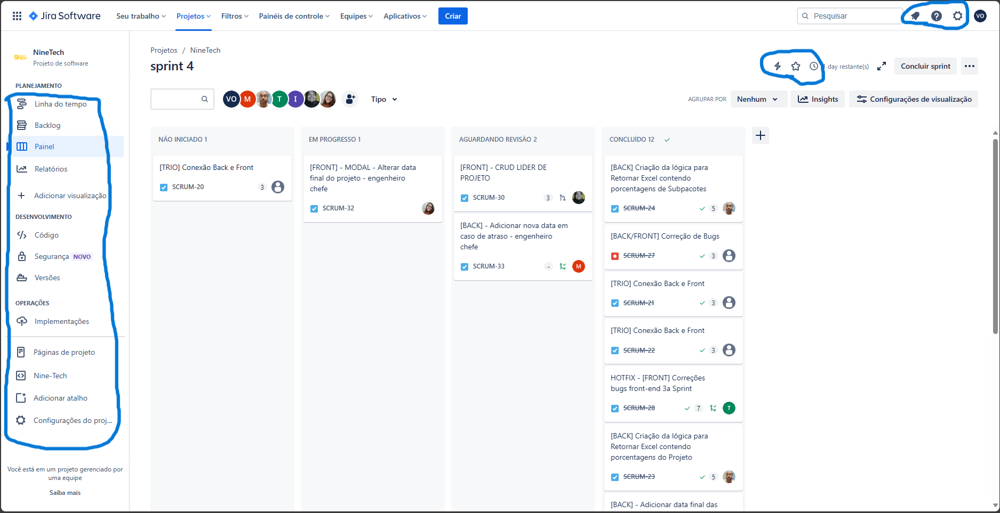
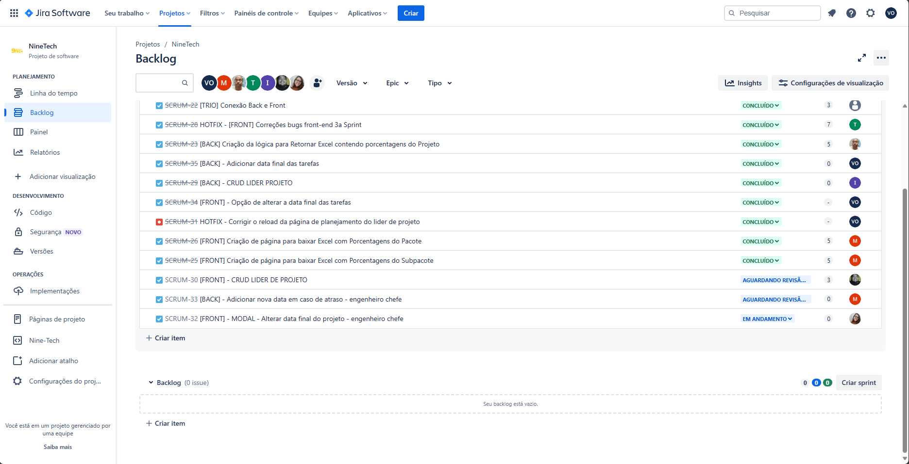
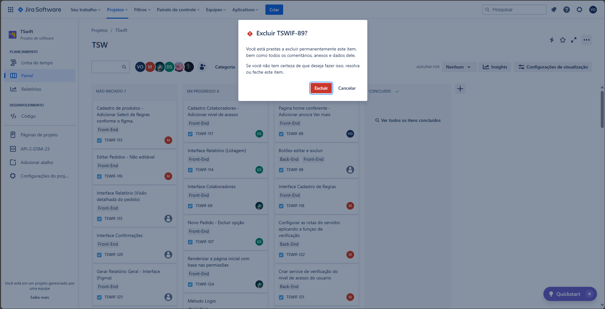
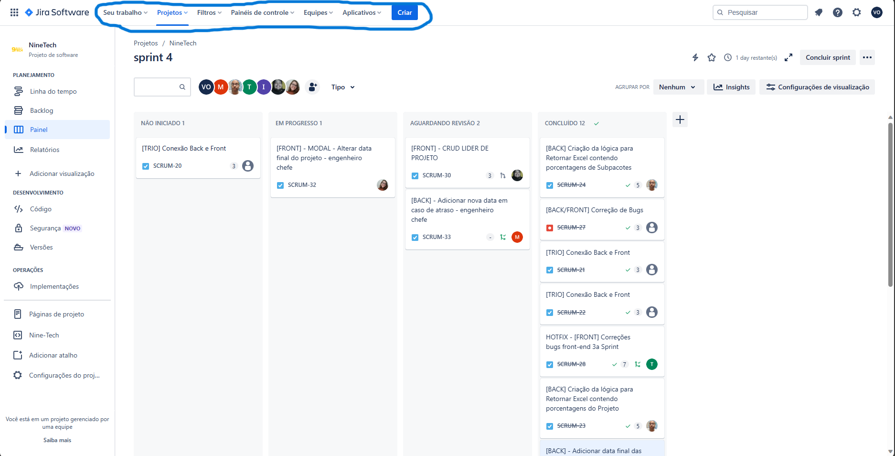
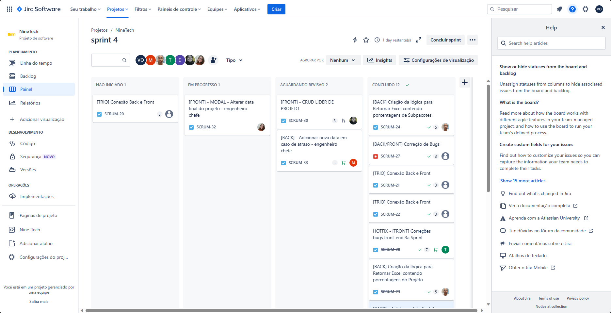

# Atividade Heurísticas

## 1) Visibilidade do Status do Sistema

- Na primeira imagem, é possível ver que o site fornece feedback acerca do status de tarefas, incluindo atualizações e comentários, o que efetivamente aumenta a visibilidade do estado do sistema.

## 2) Compatibilidade entre o sistema e o mundo real

- Na segunda imagem, observa-se que o site emprega uma linguagem alinhada ao seu público-alvo, além de incorporar símbolos em sua interface para tornar a compreensão das informações mais acessível.

## 3) Consistência e Padronização

- Na terceira imagem, destaca-se a consistência do site em relação ao layout e aos elementos visuais, alinhando-se de maneira notável aos padrões estabelecidos pela Atlassian.

## 4) Prevenção de erros

- Na quarta imagem, destaca-se a presença de mecanismos para prevenir erros no site, incluindo confirmações prévias à exclusão de itens e validações durante o preenchimento de formulários.

## 5) Estética e design minimalista

- Na quinta imagem, fica evidente que embora o site contenha muitas informações, é projetado para ser funcional e organizado, adotando um design claro e focado. As informações secundárias estão estrategicamente posicionadas em menus e abas.

## 6) Ajuda e documentação

- Na sexta imagem, observa-se que o site disponibiliza uma extensa documentação online, suporte da comunidade e tutoriais, visando auxiliar os usuários na utilização eficaz da ferramenta.

